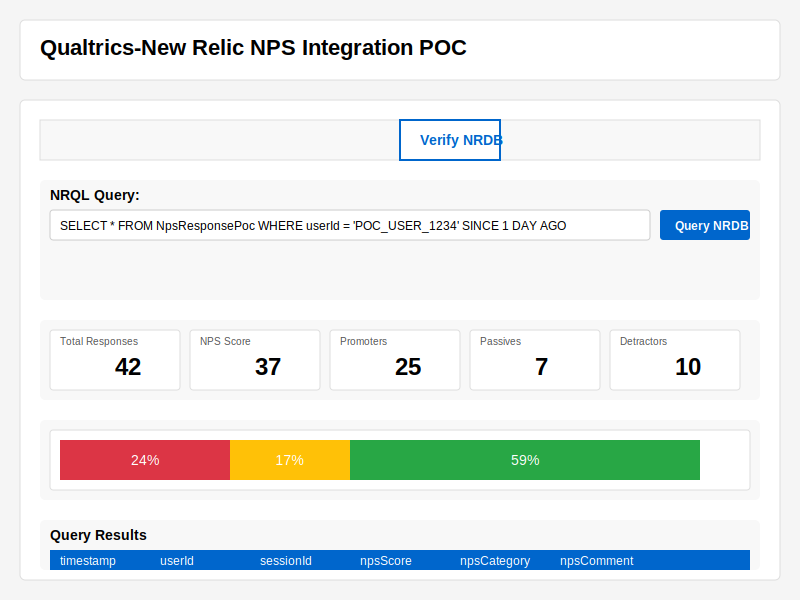

# NRDB Verification Feature

This documentation covers the NRDB (New Relic Database) Verification feature that allows users to query and verify NPS data pushed to New Relic from the integration service.

## Overview

The NRDB Verification tab provides a way to query New Relic directly from the sample application UI, allowing you to verify that NPS data is correctly being stored and is available for analysis. This is particularly useful for:

- Confirming that webhook data sent from Qualtrics (or the simulator) is reaching New Relic
- Validating that user and session IDs are correctly associated with NPS data
- Analyzing NPS scores and trends
- Troubleshooting integration issues



## Features

### Query Templates

The verification screen includes several predefined query templates:

1. **Current User Data**: Retrieves all NPS responses associated with the current user
2. **Overall NPS Score**: Calculates aggregate NPS score and counts of promoters, passives, and detractors
3. **Score Distribution**: Shows the distribution of scores by count
4. **Custom Query**: Allows you to write your own NRQL query

### Time Range Selection

You can adjust the time window for your query using the time range selector:

- Last 30 minutes
- Last hour
- Last 3 hours
- Last day (default)
- Last 3 days
- Last 7 days

### Data Visualization

The verification screen provides several ways to visualize the query results:

- **Summary Metrics**: Shows totals for responses, NPS score, and counts by category
- **Distribution Chart**: Visual representation of NPS score distribution or category breakdown
- **Results Table**: Detailed table of all data returned by the query

## Using the NRDB Verification Tab

### Basic Workflow

1. Select the "Verify NRDB" tab in the sample application
2. Choose a query template from the dropdown
3. Adjust the time range if needed
4. Click "Query NRDB" to execute the query
5. Review the results in the summary, chart, and table sections

### Custom Queries

When writing custom NRQL queries, keep these tips in mind:

- Always include `FROM NpsResponsePoc` to query the correct event type
- Include a time range using `SINCE x [MINUTES|HOURS|DAYS] AGO`
- Use `FACET` to group by attributes like `npsScore` or `npsCategory`
- Use `LIMIT` to control the number of results
- For charts, queries using `FACET` will display as distribution charts

### Example Queries

Here are some useful example queries:

```sql
-- Count responses by NPS category
SELECT count(*) FROM NpsResponsePoc FACET npsCategory SINCE 1 DAY AGO

-- Compare average scores by day of week
SELECT average(npsScore) FROM NpsResponsePoc FACET weekdayOf(timestamp) SINCE 30 DAYS AGO

-- See most recent 50 responses
SELECT * FROM NpsResponsePoc LIMIT 50

-- Check scores by sessionId
SELECT npsScore, npsCategory, npsComment FROM NpsResponsePoc 
WHERE sessionId = 'YOUR_SESSION_ID' SINCE 7 DAYS AGO
```

## Implementation Details

### Demo Mode

If your New Relic API key or account ID is not configured, the verification screen will operate in demo mode:

- Realistic demo data will be generated based on your query type
- The screen will function normally but will display a notice that you are viewing demo data
- This allows you to test the feature without actual New Relic access

### Configuration

To use the NRDB verification feature with real New Relic data, you need to configure:

1. `NEW_RELIC_USER_API_KEY` in your .env file - a User API key with query permissions
2. `NEW_RELIC_ACCOUNT_ID` in your .env file - your New Relic account ID

### Security Considerations

- The User API key is only used server-side and never exposed to the client
- Queries are executed through the sample application server, not directly from the browser
- There is no data persistence for query results

## Troubleshooting

### Common Issues

- **No Data Found**: Verify that you have sent NPS data during the selected time period
- **API Key Errors**: Check that your New Relic User API key has query permissions
- **Query Syntax Errors**: Verify NRQL syntax if using custom queries
- **Permission Errors**: Ensure your API key has access to the account ID specified

### Error Messages

- "New Relic API key or account ID not configured" - Add these values to your .env file
- "Error calling New Relic API" - Check API key permissions and network connectivity
- "Demo data - New Relic API not configured" - You're seeing simulated data, not real results
